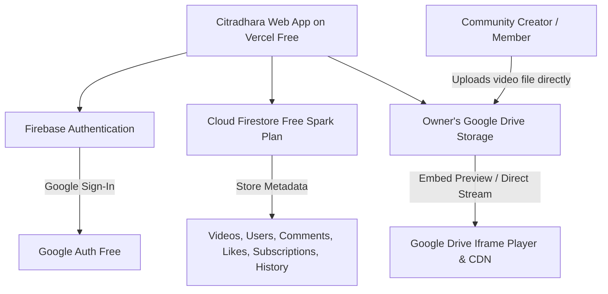

# Citradhara (चित्रधारा) — A Stream of Wonders 🎬✨
### The Premier Community Video Streaming Platform for **CodersHigh**

> *A Stream of Wonders in Tech, Coding, AI, and Digital Creation.*

**Citradhara** is an official-grade, YouTube-like video platform built specifically for the **CodersHigh** developer community. It delivers a fast, responsive video streaming experience with a **100% Zero-Cost Architecture**:
- 🌐 **Frontend & Hosting**: Next.js 16 (App Router) + Tailwind CSS on **Vercel Hobby Plan (Free Forever)**
- 📁 **Video Storage & Streaming**: **Google Drive Cloud (Free 15 GB)** with direct embed streaming (0 bandwidth costs)
- 🗄️ **Database**: **Firebase Cloud Firestore (Free Spark Plan)** for metadata, videos, comments, likes, and history
- 🔐 **Authentication**: **Google Sign-In via Firebase Auth (Free Unlimited)**

---

## ✨ Features

- 🎥 **YouTube-Identical UI & Watch Experience**:
  - 16:9 adaptive Google Drive video player with Theater mode and direct Drive source access.
  - Interactive **Like / Dislike** counter with local and cloud sync.
  - Interactive **Subscribe** button with wonder celebration confetti.
  - Expandable description box with chapters, tags, and clickable links.
  - Threaded comment section with Google user avatar and like buttons.
  - "Up Next" / Related wonder streams sidebar.
- ⚡ **Dual Video Upload Modes**:
  - **Mode 1 (Direct File Upload)**: Drag-and-drop video files (`.mp4`, `.webm`, `.mov`) from your computer straight into the admin's Google Drive folder with live progress tracking!
  - **Mode 2 (Drive Share Link)**: Paste any Google Drive share link (`https://drive.google.com/file/d/.../view`) with automatic File ID extraction and instant preview.
- 🔍 **Real-Time Search & Category Filters**:
  - Filter across community wonder streams: Web Development, Artificial Intelligence, System Design, Algorithms & DSA, DevOps & Cloud, Tech Cinema Stories, and Open Source.
  - Instant live keyword search.
- 👤 **Creator Channels & Personal Library**:
  - Channel profile pages with custom banners, handles, and uploaded streams.
  - Personal Watch History (auto-records streams watched).
  - Liked Videos collection.
- 🚀 **Plug-and-Play Demo Mode**:
  - Runs immediately out of the box with pre-seeded high quality CodersHigh community streams and simulated Google Auth, even before plugging in Firebase credentials!

---

## 🛠️ Tech Stack & Zero-Cost Architecture



---

## 🚀 Quickstart & Local Setup

### 1. Clone & Install Dependencies
```bash
cd youtube
npm install
```

### 2. Run the Development Server
```bash
npm run dev
```
Open [http://localhost:3000](http://localhost:3000) in your browser. The platform will automatically launch in **Community Demo Mode** with full interactivity!

---

## 🔑 Connecting Your Free Firebase (Auth & Database)

1. Go to the [Firebase Console](https://console.firebase.google.com/) and click **Add Project** (select the free Spark plan).
2. Go to **Authentication** → **Sign-in method** → Enable **Google Provider**.
3. Go to **Cloud Firestore** → **Create database** (start in Test mode or add read/write rules).
4. Go to **Project Settings** → **General** → Register a **Web App** (`</>`).
5. Copy your credentials into `.env.local`:
   ```env
   NEXT_PUBLIC_FIREBASE_API_KEY=AIzaSy...
   NEXT_PUBLIC_FIREBASE_AUTH_DOMAIN=your-project.firebaseapp.com
   NEXT_PUBLIC_FIREBASE_PROJECT_ID=your-project
   NEXT_PUBLIC_FIREBASE_STORAGE_BUCKET=your-project.appspot.com
   NEXT_PUBLIC_FIREBASE_MESSAGING_SENDER_ID=1234567890
   NEXT_PUBLIC_FIREBASE_APP_ID=1:123456:web:...
   ```
6. Restart your server (`npm run dev`). The status badge in the navbar will change to **Firestore Live**!

---

## 📂 Setting Up Free Direct Google Drive Uploads

To allow community members to upload video files directly from the web browser into your personal Google Drive folder (without paying for AWS S3 or Cloudflare):

### Step 1: Create a Google Drive Folder
1. Open [Google Drive](https://drive.google.com/) and create a new folder named `Citradhara Videos`.
2. Right-click the folder → **Share** → set General access to **Anyone with the link can view**.
3. Copy the Folder ID from the URL (the string after `/folders/...`).

### Step 2: Create a 100% Free Google Apps Script Webhook
1. Go to [script.google.com](https://script.google.com/) and click **New Project**.
2. Paste this lightweight script:
   ```javascript
   function doPost(e) {
     try {
       var data = JSON.parse(e.postData.contents);
       // Replace with your Google Drive Folder ID:
       var folderId = "PASTE_YOUR_DRIVE_FOLDER_ID_HERE";
       var folder = DriveApp.getFolderById(folderId);
       
       var contentType = data.mimeType || "video/mp4";
       var decodedBytes = Utilities.base64Decode(data.base64);
       var blob = Utilities.newBlob(decodedBytes, contentType, data.filename);
       var file = folder.createFile(blob);
       
       // Automatically set video permissions so anyone can stream it
       file.setSharing(DriveApp.Access.ANYONE_WITH_LINK, DriveApp.Permission.VIEW);
       
       return ContentService.createTextOutput(JSON.stringify({
         success: true,
         fileId: file.getId(),
         url: file.getUrl()
       })).setMimeType(ContentService.MimeType.JSON);
     } catch (err) {
       return ContentService.createTextOutput(JSON.stringify({
         success: false,
         error: err.toString()
       })).setMimeType(ContentService.MimeType.JSON);
     }
   }
   ```
3. Click **Deploy** → **New Deployment** → Type: **Web App**.
   - Execute as: **Me**
   - Who has access: **Anyone**
4. Click **Deploy** and copy the **Web App URL**.
5. Add the URL to your `.env.local`:
   ```env
   NEXT_PUBLIC_DRIVE_UPLOAD_WEBHOOK=https://script.google.com/macros/s/.../exec
   ```
Now whenever any CodersHigh community member uploads a video, it will upload straight into your Google Drive, generate the streaming preview, and appear on Citradhara automatically!

---

## 🚢 Deploying to Vercel (100% Free)

1. Push your repository to GitHub:
   ```bash
   git add .
   git commit -m "feat: Citradhara - A Stream of Wonders for CodersHigh"
   git branch -M main
   git remote add origin https://github.com/your-username/citradhara.git
   git push -u origin main
   ```
2. Go to [Vercel](https://vercel.com/) and click **Add New Project**.
3. Import your GitHub repository.
4. Add your Firebase and Google Drive environment variables in the Vercel dashboard.
5. Click **Deploy**! Your video platform will be live on `https://your-project.vercel.app` with free SSL and edge CDN.

---

## 🏛️ License & Community
Created with ❤️ for the **CodersHigh** community. Free to adapt and use for student hubs and developer organizations.
